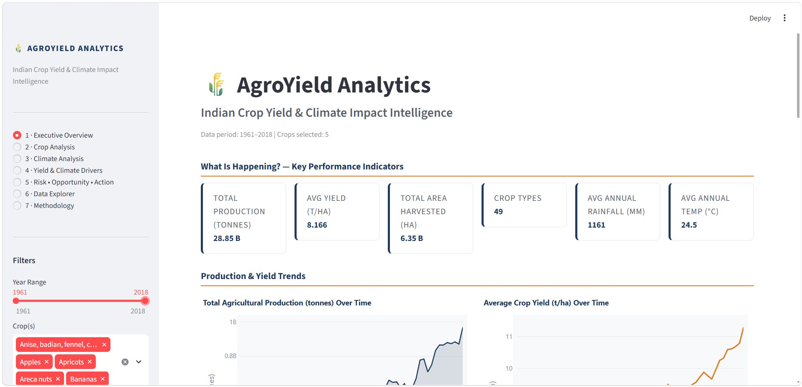
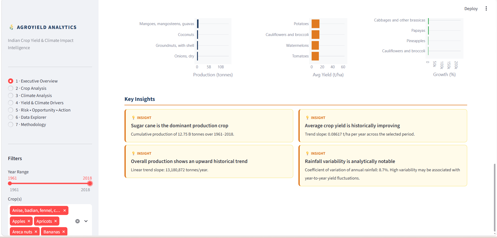
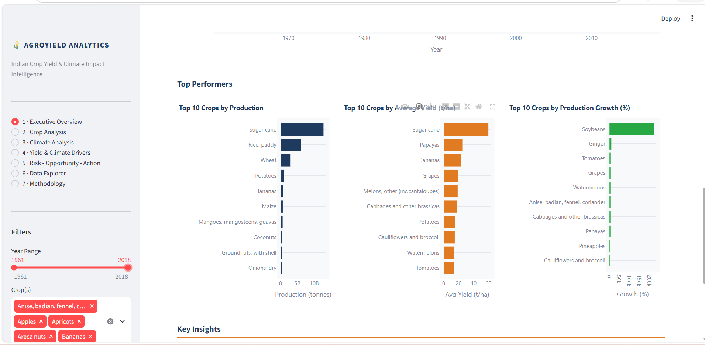

# AgroYield Analytics
### Indian Crop Yield & Climate Impact Intelligence Dashboard

**Author:** Vaishnavi  
**Program:** IBM SkillsBuild Data Analytics with AI Academic Internship Program  
**Conducted by:** BharatCares in association with AICTE  
**Domain:** Data Analytics / Business Intelligence  

---

## Project Overview

AgroYield Analytics is a complete, professional Data Analytics and Business Intelligence system that transforms raw Indian agricultural and climate data (1961–2018) into meaningful, actionable insights. The project follows the full BI pipeline:

```
RAW DATA → INFORMATION → INSIGHT → RISK / OPPORTUNITY → ACTION
```

The interactive Streamlit dashboard enables analysts, policymakers, and researchers to explore crop production trends, yield patterns, climate variability, and the statistical associations between climate variables and agricultural productivity.

---

## Problem Statement

Agricultural productivity in India is influenced by numerous environmental and production-related factors, including rainfall, temperature, cultivated area, crop type, and historical production patterns. Large volumes of agricultural data are available, but raw data alone does not provide an easy way to understand crop productivity trends or the relationship between agricultural output and climate conditions.

AgroYield Analytics analyzes historical Indian crop production and climate data from 1961 to 2018 to identify crop productivity trends, production patterns, rainfall and temperature variations, and statistical associations between climate variables and crop yield.

---

## Objectives

1. Automatically load and combine 49 crop CSV files
2. Clean and transform the agricultural data
3. Integrate rainfall and temperature datasets
4. Analyze crop production and productivity trends
5. Analyze area harvested and production patterns
6. Study historical rainfall and temperature trends
7. Identify statistical associations between climate variables and crop yield
8. Identify high-production and high-productivity crops
9. Identify crops with declining or improving historical trends
10. Identify potential analytical risk indicators and opportunities
11. Convert analytical findings into data-driven actions
12. Present findings through an interactive Streamlit dashboard

---

## Dataset

| File | Description |
|------|-------------|
| `data/Crops/*.csv` | 49 crop CSV files in FAOSTAT format |
| `data/rainfall.csv` | Annual and seasonal rainfall data (1961–2018) |
| `data/temperature.csv` | Annual and seasonal temperature data (1961–2018) |

**Dataset Period:** 1961–2018 (58 years)  
**Source:** Indian Agriculture & Climate Dataset  
**Kaggle Link:** https://www.kaggle.com/datasets/swarooprangle/indian-agriculture-and-climate-dataset-1961-2018?resource=download

The crop CSV files contain FAOSTAT-style fields including: Domain, Area, Element (Area harvested / Production / Yield), Item (crop name), Year, Unit, and Value.

---

## Technologies Used

| Technology | Purpose |
|-----------|---------|
| Python ≥ 3.9 | Core programming language |
| Streamlit ≥ 1.32 | Interactive web dashboard |
| Pandas ≥ 2.0 | Data loading, cleaning, transformation |
| NumPy ≥ 1.24 | Numerical computation and trend analysis |
| Plotly ≥ 5.18 | Interactive visualisations |
| statsmodels | OLS trendlines in scatter plots |

---

## Features

- **Automatic data loading** — discovers and loads all 49 crop CSVs automatically using glob
- **Element pivoting** — transforms long-form data (Area/Production/Yield rows) into wide-form analytical columns
- **Yield unit conversion** — converts hg/ha to tonnes/ha (÷ 10,000)
- **Climate integration** — merges rainfall and temperature datasets on Year
- **Master dataset export** — saves `data/agroyield_master.csv` for reproducibility
- **KPI dashboard** — dynamically calculated: production, yield, area, rainfall, temperature
- **Trend analysis** — linear trend slopes using numpy.polyfit
- **Correlation analysis** — Pearson r between climate variables and crop yield
- **Variability analysis** — Coefficient of Variation (CV%)
- **Rolling averages** — 10-year smoothing for climate charts
- **Risk indicators** — declining trends, high variability, negative correlations
- **Opportunity signals** — growing productivity, stable yields, positive associations
- **Data quality report** — completeness, missing values, duplicates
- **Interactive data explorer** — filter, search, select columns, download CSV
- **Full methodology page** — explains every processing decision

---

## Data Processing

1. **Load** — All 49 CSV files discovered automatically via `glob.glob("data/Crops/*.csv")`
2. **Standardise** — Column names normalised (strip whitespace, case-insensitive mapping)
3. **Crop name extraction** — From `Item` column or filename fallback
4. **Filter Elements** — Only `Area harvested`, `Production`, `Yield` retained
5. **Pivot** — Long-form → wide-form using `pivot_table(index=["Crop","Year"])`
6. **Unit conversion** — `Yield (t/ha) = Yield (hg/ha) / 10000`
7. **Climate merge** — Left join on `Year` with rainfall.csv and temperature.csv
8. **Save** — Master dataset written to `data/agroyield_master.csv`

---

## Analytics Performed

| Analysis | Method |
|----------|--------|
| Production trend | Time-series aggregation by year |
| Yield trend | Linear trend slope (numpy.polyfit degree 1) |
| Growth rate | Percentage change (first vs last year) |
| Variability | Coefficient of Variation (CV%) |
| Climate correlation | Pearson r (yield vs rainfall/temperature) |
| Rolling average | 10-year rolling mean |
| Crop ranking | Sorted by total production / average yield |
| Risk indicators | Threshold-based rules on trend, CV, correlation |

---

## Dashboard Pages

| Page | Content |
|------|---------|
| 1 · Executive Overview | KPIs, production/yield/area trends, top performers, key insights |
| 2 · Crop Analysis | Crop comparison table, production/yield/area charts, trend lines, category breakdown |
| 3 · Climate Analysis | Annual rainfall/temperature trends, monthly distribution, seasonal trends |
| 4 · Yield & Climate Drivers | Scatter plots, time-series subplots, correlation heatmap, association interpretation |
| 5 · Risk • Opportunity • Action | Per-crop risk/opportunity flags, portfolio overview, analytical action recommendations |
| 6 · Data Explorer | Interactive filter/search/download, data quality report |
| 7 · Methodology | Full pipeline explanation, statistical methods, caveats |

---

## Project Workflow

```
RAW AGRICULTURAL DATA (49 CSVs + rainfall + temperature)
        ↓
DATA CLEANING (column standardisation, type conversion, deduplication)
        ↓
DATA TRANSFORMATION (element pivoting, yield unit conversion)
        ↓
DATA INTEGRATION (merge on Year → master dataset)
        ↓
EDA (trends, distributions, rankings)
        ↓
STATISTICAL ANALYSIS (mean, std, CV, correlation, trend slope)
        ↓
VISUALISATION (Plotly interactive charts)
        ↓
INSIGHTS (dynamic KPIs, analytical findings)
        ↓
RISK / OPPORTUNITY (threshold-based analytical flags)
        ↓
ACTION (data-driven investigation recommendations)
```

---

## Installation

```bash
# Clone or download the project
cd AgroYieldAnalytics

# Install dependencies
pip install -r requirements.txt
```

---

## Run Application

```bash
streamlit run Vaishnavi_AgroYieldAnalytics.py
```

The application will open in your browser at `http://localhost:8501`.

---

## Project Structure

```
AgroYieldAnalytics/
│
├── Vaishnavi_AgroYieldAnalytics.py
├── requirements.txt
├── README.md
├── Vaishnavi_AgroYieldAnalytics_ProjectReport.docx
│
├── screenshots/
│   ├── executive-overview.png
│   ├── dashboard-analysis.png
│   └── key-insights.png
│
└── data/
    ├── Crops/
    │   ├── apples.csv
    │   ├── apricots.csv
    │   ├── areca nuts.csv
    │   ├── bananas.csv
    │   ├── barley.csv
    │   ├── ...
    │   └── [49 crop CSV files]
    │
    ├── rainfall.csv
    ├── temperature.csv
    └── agroyield_master.csv                # Generated at runtime
```

---

## Key Insights

The following insights are dynamically derived from the dataset at runtime:

- **Dominant crop by production** is identified from cumulative FAOSTAT data
- **Overall production trend** is measured by linear regression slope across years
- **Average yield trend** shows whether productivity per hectare has improved historically
- **Rainfall variability** (CV%) indicates inter-annual climate uncertainty
- **Climate–yield associations** vary significantly by crop type
- **High-yield crops** do not always correspond to high total production

> Note: All insights are based on national-level aggregated data. Regional disaggregation and additional variables (soil, irrigation, inputs) would strengthen analytical conclusions.

---

## Limitations

1. Data is aggregated at the national level — regional patterns are not captured
2. Only annual climate variables are used — sub-annual patterns may be more informative
3. Correlation ≠ Causation — all associations are historical, not causal
4. Missing data exists for some crops in certain years
5. External factors (government policy, irrigation, fertiliser, pest/disease) are not in the dataset
6. The dataset ends at 2018 — more recent trends are not reflected

---

## Future Scope

1. **State-level disaggregation** — Analyse productivity differences across Indian states
2. **Predictive modelling** — Build regression or ML models to estimate yield from climate inputs
3. **Irrigation integration** — Incorporate irrigation coverage data per crop and region
4. **Soil data integration** — Add soil quality/type maps for deeper analysis
5. **Extreme weather events** — Identify and annotate drought/flood years
6. **Market price integration** — Combine production data with MSP and market price history
7. **Interactive maps** — Geospatial visualisation of crop productivity across India
8. **Automated reporting** — Generate PDF reports from dashboard findings

---
## 📸 Dashboard Preview

### Executive Overview



### Dashboard Analysis



### Key Insights



## Author

**Vaishnavi**  
IBM SkillsBuild Data Analytics with AI Academic Internship Program  
Conducted by BharatCares in association with AICTE  

---

*Project Domain: Data Analytics / Business Intelligence*  
*Primary Technologies: Python, Pandas, NumPy, Plotly, Streamlit*  
*Dataset: Indian Agriculture & Climate Dataset (1961–2018)*
